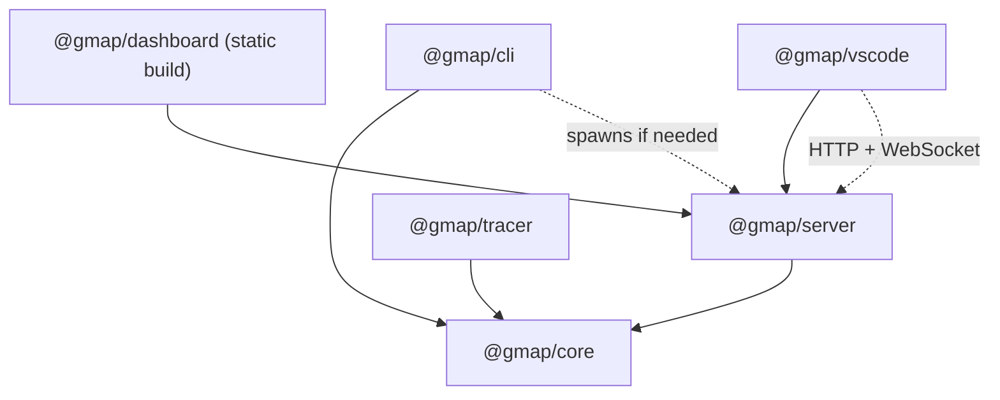

# gmap — Codebase Graph Mapper

> *Understand codebases at the speed AI generates them.*

gmap statically analyses TypeScript/JavaScript projects and builds a navigable call graph stored in a local SQLite database. Query it from the CLI, the VS Code extension, or the browser dashboard — all without leaving your machine.

---

## Quick Start

```bash
# Install globally
npm install -g gmap-cli

# Index your project
gmap scan .

# Ask questions
gmap why approveEstimate        # who calls this?
gmap impact approveEstimate     # what breaks if I change it?
gmap trace approveEstimate      # full call chain

# Open the interactive graph dashboard
gmap serve                      # → http://localhost:7842
```

---

## Package Architecture

```
  @gmap/cli ──────────────────────────────┐
                                          │
  @gmap/dashboard ─── (Vite build) ──┐   │
                                     ▼   ▼
                              ┌─────────────────┐
  @gmap/vscode ───────────── ▶│   @gmap/core    │
                              │                 │
  @gmap/server ──────────── ▶│  • scanner      │
                              │  • graph engine │
  @gmap/tracer ─────────── ▶│  • SQLite DB    │
                              │  • adapters     │
                              └─────────────────┘
```

Every package consumes `@gmap/core` — the single source of truth. No package imports from a sibling.



### Package descriptions

| Package | Role |
|---|---|
| `@gmap/core` | Scanner, graph engine, SQLite layer, language adapter registry. The only package allowed to touch the database. |
| `@gmap/cli` | Commander.js CLI. Thin wrapper — all logic lives in core. |
| `@gmap/server` | Express + WebSocket API server. Serves the dashboard as static files. Binds to `127.0.0.1` only. |
| `@gmap/dashboard` | React + Cytoscape.js graph visualiser. Vite builds it to `packages/server/dist/public/`. |
| `@gmap/vscode` | VS Code extension. Talks to the API server over HTTP/WebSocket — never imports core directly. |
| `@gmap/tracer` | Runtime instrumentation (M7). Patches function calls and streams real call events to the server. |

---

## CLI Reference

| Command | What it does |
|---|---|
| `gmap scan <path>` | Walk files, parse symbols, write to SQLite |
| `gmap why <symbol>` | List every caller of a symbol |
| `gmap impact <symbol>` | Blast radius — everything that would break |
| `gmap trace <symbol>` | Full call chain from entrypoints |
| `gmap explain <symbol>` | AI-generated description (opt-in) |
| `gmap serve` | Start the API server + open dashboard |

All commands use full English words. No abbreviations. No cryptic flags.

---

## Architecture & Governance

Design decisions, standards, and workflow rules are documented here:

### Architecture Decisions (ADRs)

| ADR | Title |
|---|---|
| [0001](documentation/adr/0001-local-first.md) | Local-first, server-optional |
| [0002](documentation/adr/0002-sqlite.md) | SQLite as the single source of truth |
| [0003](documentation/adr/0003-language-adapters.md) | Language-agnostic adapter architecture |
| [0004](documentation/adr/0004-websocket-rest.md) | WebSocket for streaming, REST for queries |
| [0005](documentation/adr/0005-vscode-extension.md) | VS Code extension as primary distribution |
| [0006](documentation/adr/0006-ts-morph.md) | ts-morph over raw TypeScript Compiler API |
| [0007](documentation/adr/0007-call-graph-accuracy.md) | Call graph accuracy over completeness |
| [0008](documentation/adr/0008-ai-optional.md) | AI is strictly optional |
| [0009](documentation/adr/0009-web-dashboard.md) | Web dashboard over terminal UI |
| [0010](documentation/adr/0010-default-port.md) | Port 7842 as default API port |
| [0011](documentation/adr/0011-cli-ergonomics.md) | CLI commands read like plain English |

### Standards & Processes

- 🤝 [Contributing Guidelines](CONTRIBUTING.md) — Formatting, commit rules, and monorepo guidelines.
- 💡 [RFC Process](documentation/rfc-process.md) — How to propose database, protocol, or design changes.
- 🛡️ [Error Philosophy](documentation/error-philosophy.md) — Structured boundaries, adapters contract, and throwing policy.
- 📦 [API Export Guide](documentation/public-api-freeze.md) — Stable public exports vs internal namespaces.

---

## Roadmap

| Milestone | Description | Status |
|---|---|---|
| **Phase 1** | Monorepo scaffold | ✅ Done |
| **M1** | Repository scanner (file walk + ts-morph parse) | 🔜 Next |
| **M2** | Graph engine (SQLite-backed call graph) | — |
| **M3** | REST + WebSocket API server | — |
| **M4** | React graph dashboard | — |
| **M5** | VS Code extension (hover, CodeLens, sidebar) | — |
| **M6** | CLI commands (`why`, `impact`, `trace`) | — |
| **M7** | Runtime tracer (real call edges) | — |
| **M8** | AI explain layer (Ollama, Anthropic, OpenAI) | — |

---

## Development

```bash
# Install dependencies
pnpm install

# Build all packages
pnpm build

# Type-check all packages
pnpm typecheck

# Run all tests
pnpm test

# Build + watch (Turbo)
pnpm dev
```

### Requirements
- Node.js 20+ (`.nvmrc` pins the version)
- pnpm 9+

---

## Design Principles

- **Local-first**: runs entirely on your machine. No cloud, no telemetry, no account required.
- **AI-optional**: core features work without any AI. `gmap explain` is the only AI-gated command.
- **TypeScript-first, language-agnostic**: the parser is pluggable. Python and Go adapters don't touch the graph engine.
- **Honest about uncertainty**: unresolvable call edges are marked `unresolved`, not silently dropped.

---

## License

MIT
